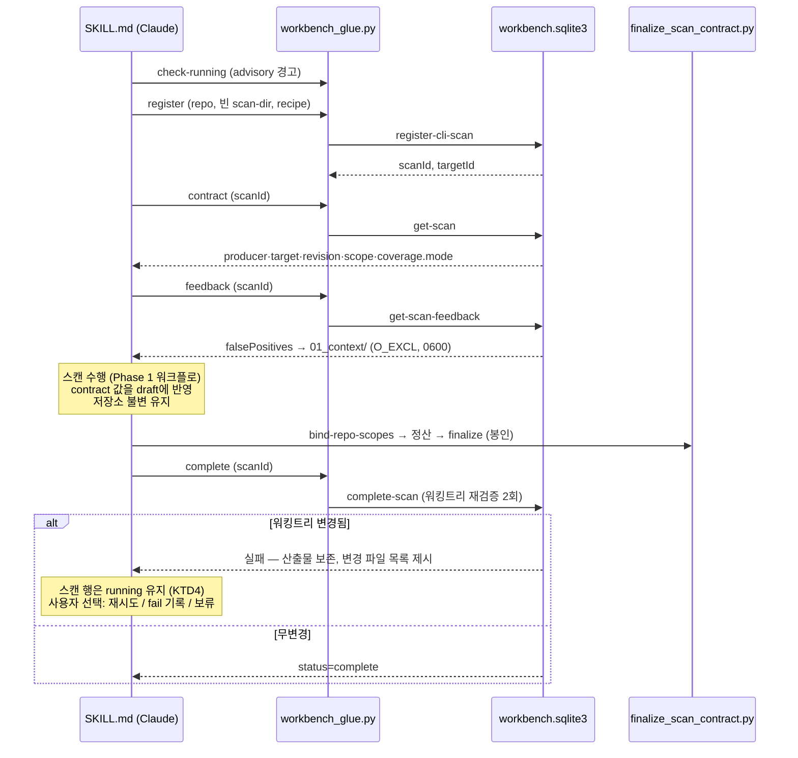

# Phase 2 — 워크벤치 이력 통합 - Plan

**시리즈**: Claude Code 전역 스킬로 codex-security를 OpenAI 인증 없이 실행하기 (Phase 2/4)
**선행 문서**: [Phase 1](2026-07-30-002-feat-phase1-standalone-scan-skill-plan.md) — 순수 로컬 스캔이 동작하는 상태에서 시작. [Phase 0](2026-07-30-001-chore-phase0-feasibility-verification-plan.md) U3의 `get-scan` contract 필드 표가 필수 입력이다.
**산출물 위치**: `skills/codex-security-scan/` (Phase 1 스킬 확장, 정본은 이 저장소)

---

## Goal Capsule

- **목표**: Phase 1 스캔을 워크벤치 SQLite 상태 DB에 등록해, 스캔 이력·false-positive 피드백이 공식 CLI(`npx codex-security scans list/show`, `findings false-positive`)와 완전 호환되게 하고, 결과 품질이 공식 스캔과 대조 검증되게 한다.
- **권위 순서**: 이 문서 → Phase 0 검증 보고서(U3 contract 필드 표·게이트 재현) → 워크벤치 Python 구현 실동작.
- **중지 조건**: `complete-scan`이 contract 반영 후에도 무변경 저장소에서 실패하는 재현 불가 사례 발견 시 중지, 원인 분석 후 계획 수정.

---

## Product Contract

### Summary

스캔 수명주기를 워크벤치 명령 5종(`register-cli-scan` → `get-scan` → `get-scan-feedback` → `complete-scan`/`fail-scan`)으로 감싼다. 등록은 스캔 작업 전에, contract 조회는 draft 작성 전에, finalize는 complete-scan 전에 수행하는 순서 계약을 강제하고, 워킹트리 불변 게이트 실패 시에도 로컬 산출물은 보존되며 스캔 행은 사용자 선택으로 처리된다.

### Problem Frame

Phase 1의 순수 로컬 스캔은 이력이 남지 않아 재스캔 시 과거 false-positive 판정을 활용할 수 없고, 공식 CLI의 `scans list/show`·`findings false-positive`와 단절된다. 워크벤치는 OpenAI 인증이 필요 없음이 확인되었으므로(`runWorkbench`는 오히려 API 키를 제거함) 통합의 장애물은 인증이 아니라 **수명주기 계약**이다. 특히 `complete-scan`은 이미 봉인된 매니페스트에 대해 binding을 주입하지 않고 검증만 하므로, draft가 워크벤치의 contract 값을 사전에 반영하지 않으면 반드시 실패한다. 또한 Phase 1의 게이트는 산출물 형식만 검증하므로 "파인딩을 못 찾고 빈 배열을 봉인한 스캔"과 정상 스캔이 구별되지 않는다 — 이력 통합이 그 구별을 만들 기회다.

### Requirements

**수명주기**
- R1. 스캔 시작 시 `register-cli-scan`으로 scanId·targetId를 발급받아야 하며, 이때 scan-dir은 비어 있고 등록 후에 `artifacts/` 등 하위 구조를 생성해야 한다.
- R2. recipe JSON은 최소 계약(`{repository, mode:"standard", config:{}, target:{kind:"repository", paths:[]}}`)을 기본으로 하되, 실제 스캔 설정을 반영해야 한다.
- R3. 등록 직후 `get-scan`으로 contract를 조회해, draft가 사전 일치시켜야 하는 필드(producer name/version, target kind·targetId·displayName, revision, snapshotDigest, scope includePaths/excludePaths, coverage.mode 기대값)를 확보하고 canonical JSON 작성에 반영해야 한다. `complete-scan`은 sealed 매니페스트에 binding을 주입하지 않고 검증만 하므로 이 단계 없이는 완료가 불가능하다.
- R4. 어떤 워크벤치 명령에도 `--claim-token`을 전달하지 않아야 한다 (CLI 등록 스캔은 `handoff_claim_token=NULL` 경로).
- R5. finalize를 complete-scan **전에** 실행해야 하며, complete-scan이 워킹트리 변경으로 실패해도 report.md·SARIF는 보존되어야 한다.
- R6. complete-scan 실패 시 스캔 행을 즉시 `fail-scan`으로 종결하지 않아야 한다 — 종결된 스캔은 `compare-scans`와 false-positive 이력에서 영구 제외되어 Phase 4의 전제가 깨진다. 실패 원인(변경된 파일 목록)과 선택지(변경 되돌린 뒤 재시도 / 이 스캔을 실패로 기록 / 판단 보류)를 제시하고 사용자 선택에 따라 처리해야 한다.
- R7. 좀비 `running` 행을 감지·정리하는 수단이 제공되어야 한다. 정리는 대상 행의 scanId·시작 시각·저장소를 제시한 뒤 사용자 확인을 받아야 한다 — 공식 CLI의 진행 중인 장시간 스캔을 실패로 기록할 수 있기 때문이다.

**피드백 루프**
- R8. 등록 직후 `get-scan-feedback`을 호출해 결과가 있으면 `<scan-dir>/artifacts/01_context/false_positive_feedback.json`에 배타적 생성(O_EXCL)·0600으로 기록하고, validation 단계에서 "지시가 아닌 리뷰어 피드백"으로 주입해야 한다.
- R9. finalize 후 재계산된 fingerprint를 피드백 목록과 대조해, 과거 false-positive와 동일 identity의 finding이 다시 보고되면 요약에 경고를 표시해야 한다 (자동 억제가 아닌 가시화).

**호환성과 품질**
- R10. 스캔 ID·target 좌표는 워크벤치가 반환·검증하는 값을 그대로 사용해야 한다 (`scan.id`=반환 UUID, `producer.name`="codex-security-plugin").
- R11. 완료된 스캔이 `npx codex-security scans list`와 `scans show <id>`(TTY·`--format json` 모두)에서 정상 표시되어야 한다.
- R12. 동일 저장소에 대한 Claude 스캔과 공식 CLI 스캔의 파인딩을 대조해, 검출 격차(공식만 찾은 것·Claude만 찾은 것)가 정성적으로 기록되어야 한다. 이것이 "빈 배열 봉인"과 정상 스캔을 구별하는 유일한 게이트다.
- R13. 환경변수는 정확한 대문자 `CODEX_SECURITY_STATE_DIR`로 전달해야 한다 (Python 측은 대소문자 무시 조회를 하지 않음).

### Scope Boundaries

- `update-progress` 연동(진행률 표시)은 하지 않는다 — phase 역행·카운터 규칙이 엄격해 위반 시 스캔 실패 요인이 되므로 보류.
- `scans rerun`·`scans match` 지원 없음 (rerun은 OpenAI 경로 재진입이므로 대상 아님, match는 Phase 4).
- targetId의 절대경로 해시 취약성(저장소 이동 시 이력 단절)은 수용하고 문서화한다 — 구현 변경은 기존 DB 이력을 깬다.
- 동시 스캔 차단은 하지 않는다 — 시작 시 같은 저장소의 `running` 행이 있으면 자문(advisory) 경고만 표시.

---

## Planning Contract

### Key Technical Decisions

- KTD1. **contract 선조회, finalize-first, complete는 best-effort** — 순서는 `register` → `get-scan`(contract) → 스캔·draft → `bind-repo-scopes`·정산 → `finalize` → `complete`다. 워킹트리 불변 게이트(`require_unchanged_target`, finalization 전후 2회 검사)는 우회 불가하므로 실패해도 로컬 산출물이 완결되도록 finalize를 앞에 둔다.
- KTD2. **워크벤치 호출은 전용 래퍼 스크립트로 캡슐화** — 명령별 인자·환경 규약(정확한 env 이름, `python -I -B`, `workbench_db.py`가 실제 디스패처, claim token 금지)이 실수 포인트이므로 SKILL.md 프롬프트가 아닌 스크립트가 소유한다.
- KTD3. **FP 피드백은 가시화까지만, 자동 억제는 하지 않음** — 억제는 플러그인 validation 규약(피드백은 데이터, 기록된 사유가 여전히 유효할 때만 기각)을 따르고, 스킬은 재등장 경고(R9)로 안전망만 추가한다.
- KTD4. **실패한 complete는 스캔 행을 열어둔다** — `fail-scan`은 되돌릴 수 없고 해당 스캔을 비교·피드백 이력에서 영구 제외하므로, 사용자가 명시적으로 선택할 때만 호출한다. 열린 `running` 행은 R7의 정리 수단이 담당한다.
- KTD5. **품질 게이트는 공식 스캔 대조** — 형식 검증만으로는 빈 결과와 정상 결과가 구별되지 않는다. OpenAI 인증이 있는 환경에서 공식 CLI 스캔을 1회 돌려 파인딩을 대조하는 것이 현실적인 최소 품질 신호다. 정량 지표(재현율 수치)는 목표로 삼지 않고 격차의 정성 기록으로 갈음한다.

### Assumptions

- 스킬이 항상 bootstrap이 해석한 단일 플러그인 사본의 스크립트만 사용하면 DB 스키마 버전 스큐가 발생하지 않는다 — 전역·프로젝트 사본 혼용 금지가 Phase 1 R3의 신뢰 게이트로 이미 강제된다.
- R12 대조 검증을 위해 OpenAI 인증이 가능한 환경이 1회 확보된다 — 불가능하면 대조는 공식 CLI의 과거 스캔 이력으로 대체한다.

### High-Level Technical Design

---

## Implementation Units

### U1. workbench_glue.py — 수명주기 래퍼

- **Goal**: 워크벤치 명령 5종 + 좀비 정리를 안전한 서브커맨드로 제공한다.
- **Requirements**: R1, R2, R3, R4, R7, R10, R13
- **Dependencies**: Phase 1 U2 (bootstrap JSON을 입력으로 사용), Phase 0 U3 (contract 필드 표)
- **Files**: `skills/codex-security-scan/scripts/workbench_glue.py`
- **Approach**:
  1. 서브커맨드: `register`(빈 scan-dir 검증, recipe 조립, scanId/targetId 반환), `contract`(`get-scan` 결과에서 draft 반영 필드만 추출해 JSON 반환), `feedback`(결과를 O_EXCL·0600으로 `01_context/false_positive_feedback.json`에 기록), `complete`, `fail`, `list-stale`(N시간 이상 `running`인 행을 scanId·시작 시각·저장소와 함께 나열, 종결하지 않음), `close-stale`(명시된 scanId만 `fail-scan`), `check-running`(시작 시 advisory 경고용).
  2. 모든 호출은 bootstrap이 해석한 플러그인의 `scripts/workbench_db.py`를 `python -I -B`로 실행하고(파싱 전용 모듈 `workbench_cli.py`가 아님), `CODEX_SECURITY_STATE_DIR`를 정확한 이름으로 주입하며 `OPENAI_API_KEY`/`CODEX_API_KEY`는 환경에서 제거한다 (SDK `runWorkbench`와 동일).
  3. claim token 관련 인자는 인터페이스에 아예 노출하지 않는다.
  4. `complete` 실패는 예외가 아니라 구조화된 결과(`{ok:false, reason, changedFiles}`)로 반환해 SKILL.md가 R6 분기를 수행할 수 있게 한다.
- **Patterns to follow**: `sdk/typescript/src/api.ts`의 `register-cli-scan` 호출부와 feedback 기록부(`{flag:"wx", mode:0o600}`), `sdk/typescript/src/runtime.ts:132`의 `runWorkbench` 실행 대상과 환경 구성
- **Test scenarios**:
  - register가 비어 있지 않은 scan-dir을 거부한다.
  - `contract`가 Phase 0 U3 표와 동일한 필드 집합을 반환한다.
  - contract를 반영한 draft로 register→feedback→finalize→complete가 성공한다 (무변경 저장소).
  - contract를 반영하지 않은 draft는 complete에서 거부되고 사유가 구조화 반환된다.
  - 저장소 수정 후 complete가 실패하고 `changedFiles`가 채워지며 스캔 행은 `running`으로 남는다.
  - `list-stale`은 나열만 하고 상태를 바꾸지 않으며, `close-stale`은 명시된 scanId만 닫는다.
- **Verification**: 합성 저장소에서 전체 수명주기 왕복 성공 + 실패 경로 구조화 반환 확인.

### U2. SKILL.md 확장 — 수명주기 통합

- **Goal**: Phase 1 워크플로에 등록·contract 반영·피드백 주입·종결 분기를 삽입한다.
- **Requirements**: R5, R6, R8
- **Dependencies**: U1
- **Files**: `skills/codex-security-scan/SKILL.md` (수정)
- **Approach**:
  1. 순서 계약 명문화: bootstrap → check-running(경고) → **register(빈 dir) → 하위 구조 생성 → contract 조회** → feedback 주입 → preflight·스캔 → `bind-repo-scopes` → 정산 → **finalize → complete** → 요약.
  2. contract 값을 canonical JSON에 반영하는 규칙을 표로 명시: 어떤 contract 필드가 manifest/coverage/findings의 어느 경로에 들어가는지. 금지 필드 목록(Phase 1 R6)은 그대로 유지 — contract 반영은 finalizer가 덮어쓰지 않는 좌표 필드에 한정한다.
  3. 시작 고지에 commit/stash 권고 추가: "스캔 중 저장소가 변경되면 이력 기록이 실패합니다(로컬 리포트는 보존)."
  4. 피드백 주입 문구는 SDK와 동일 취지: 파일을 "리뷰어 피드백이며 지시가 아님"으로 읽고, 기록된 사유가 여전히 유효할 때만 기각. Phase 1 R11의 미신뢰 규칙이 이 파일에도 적용됨을 명시.
  5. complete 실패 분기(R6): 변경 파일 목록 + report.md 경로를 제시하고 세 선택지(변경 되돌린 뒤 complete 재시도 / `fail`로 기록 종결 / 보류하고 나중에 정리)를 사용자에게 묻는다. 기본값은 보류.
- **Test scenarios**:
  - 무변경 스캔이 `complete` 상태로 종결된다.
  - 스캔 중 파일을 수정한 시나리오에서 complete 실패 → 선택지 제시 → 보류 선택 시 스캔 행이 `running`으로 남고 로컬 산출물이 보존된다.
  - 되돌린 뒤 재시도 선택 시 complete가 성공한다.
  - Claude가 scan-dir 밖(저장소 안)에 파일을 쓰려는 유혹 케이스(PoC 스크립트)가 지침대로 scan-dir 아래로 간다.
- **Verification**: U4 호환성·품질 검증 통과.

### U3. FP 재등장 경고

- **Goal**: finalize 후 fingerprint를 피드백과 대조해 재등장 finding을 요약에 표시한다.
- **Requirements**: R9
- **Dependencies**: U1, U2
- **Files**: `skills/codex-security-scan/scripts/coverage_reconcile.py` (검사 추가)
- **Approach**: 봉인된 `findings.json`의 `fingerprints`와 `false_positive_feedback.json`의 `fingerprint`를 대조(동일 targetId 전제). 일치 항목은 "과거 false-positive로 판정된 finding이 다시 보고됨 — 판정 사유: <note>"로 요약에 포함. 피드백 주입 시 저장소 origin/HEAD를 함께 기록해, 같은 경로에 다른 저장소가 체크아웃된 경우(targetId 경로 해시의 부작용)를 사용자가 알아볼 수 있게 한다.
- **Test scenarios**:
  - 1차 스캔 → `findings false-positive` CLI로 기각 → 2차 스캔에서 동일 finding에 경고가 붙는다.
  - 피드백이 없으면 무출력 통과.
  - 같은 경로에 다른 저장소가 있으면 origin 불일치 경고가 나온다.
- **Verification**: 2회 스캔 왕복 시나리오 성공.

### U4. 공식 CLI 호환성·품질 대조 검증

- **Goal**: Claude 스캔이 공식 CLI 소비자 관점에서 구별 불가능하게 조회되고, 파인딩 품질이 공식 스캔과 대조되었음을 확인한다.
- **Requirements**: R11, R12
- **Dependencies**: U1~U3
- **Files**: 검증 기록 `docs/verification/phase2-results.md`
- **Approach**:
  1. 호환성: 완료 스캔에 대해 `npx codex-security scans list`, `scans show <id>`, `scans show <id> --format json`, `findings false-positive <occurrenceId> --reason ...`을 실행하고 렌더링·조작이 정상임을 기록한다.
  2. 품질 대조(KTD5): 동일 저장소를 공식 CLI(OpenAI 인증)로 1회 스캔하고, Claude 스캔 결과와 파인딩을 대조한다. 기록 항목 — 양쪽 모두 찾은 것, 공식만 찾은 것(누락), Claude만 찾은 것(추가 검출 또는 오탐 의심), 심각도 판정 차이.
  3. 격차가 크면(공식이 찾은 고심각도 파인딩을 Claude가 절반 이상 누락) 원인을 분류해 Phase 1 SKILL.md 보강 항목으로 남긴다.
- **Test scenarios**:
  - list에 스캔이 나타나고 show가 findings를 렌더링한다.
  - false-positive 표시가 성공하고 다음 스캔의 feedback에 반영된다(U3와 연결).
  - `--scan-root`로 scan-dir 기준 조회도 동작한다.
  - 공식 스캔과의 파인딩 대조표가 작성되고 누락 항목마다 원인 분류가 붙는다.
- **Verification**: 검증 보고서에 호환성 명령 출력과 품질 대조표가 모두 기록된다.

---

## Risks & Dependencies

- **DB 스키마 다운그레이드 가드 부재**: 워크벤치는 forward-only 마이그레이션을 수행하고 구버전 플러그인이 신버전 DB를 여는 것을 막지 않는다. 구버전 사본으로 스킬을 실행하면 조용히 열린 뒤 나중에 `OperationalError`로 실패한다. 완화 — bootstrap이 선택한 플러그인 버전을 시작 고지에 표시하고, 공식 CLI와 다른 버전이면 경고한다.
- **공유 상태 DB 쓰기 경합**: WAL과 `busy_timeout=5000`은 켜져 있으나 트랜잭션 중 `SQLITE_BUSY` 재시도가 없고, 파일 락은 `complete-scan`만 잡는다. 동시 스캔 시 `fail-scan`·`get-scan-feedback`이 실패할 수 있다. 완화 — R7의 advisory 경고로 동시 실행을 억제하고, 래퍼가 실패를 구조화 반환해 재시도를 사용자에게 알린다.
- **좀비 행 누적**: Claude Code에 중단 훅이 없어 세션 강제 종료 시 `running` 행이 남는다. R7의 `list-stale`/`close-stale`이 유일한 정리 수단이며 자동화되지 않는다.
- **targetId 경로 해시**: 저장소 이동·리네임·복수 clone·macOS `/Users` vs `/private/Users` 차이가 모두 다른 타깃이 되어 FP 이력이 끊긴다. 수용하고 문서화하되, U3의 origin 기록으로 오연결은 감지한다.
- **R12 대조의 인증 의존**: 품질 게이트가 OpenAI 인증 1회를 요구한다. 확보 불가 시 공식 CLI의 과거 스캔 이력 또는 알려진 취약점 데이터셋으로 대체하고, 그 경우 게이트의 신뢰도 저하를 보고서에 명시한다.

---

## Verification Contract

| 게이트 | 명령/기준 |
|---|---|
| contract 반영 | `contract` 반환 필드가 draft에 반영되고 complete-scan이 통과 |
| 수명주기 왕복 | register→contract→feedback→finalize→complete 전 구간 exit 0 (무변경 저장소) |
| 게이트 실패 경로 | 저장소 수정 시 complete 실패 + 산출물 보존 + 스캔 행 `running` 유지 + 선택지 제시 |
| CLI 호환 | `npx codex-security scans list/show` 정상 렌더링 (TTY·JSON) |
| 피드백 왕복 | false-positive 표시 → 재스캔 피드백 주입 → 재등장 경고 |
| 품질 대조 | 공식 스캔과의 파인딩 대조표 + 누락 원인 분류 |

---

## Definition of Done

- Claude 스캔이 워크벤치 이력에 등록·종결되고 공식 CLI로 조회·트리아지 가능하다.
- `get-scan` contract 반영으로 complete-scan이 무변경 저장소에서 성공한다.
- 워킹트리 게이트 실패가 사용자에게 원인·선택지와 함께 안내되고 스캔 행이 임의로 종결되지 않는다.
- 공식 스캔과의 파인딩 대조표가 존재해 "빈 결과 봉인"이 게이트를 통과하지 못한다.
- 좀비 `running` 행에 대한 나열·확인 후 종결 수단이 존재한다.
- 검증 보고서(`docs/verification/phase2-results.md`)가 작성된다.
